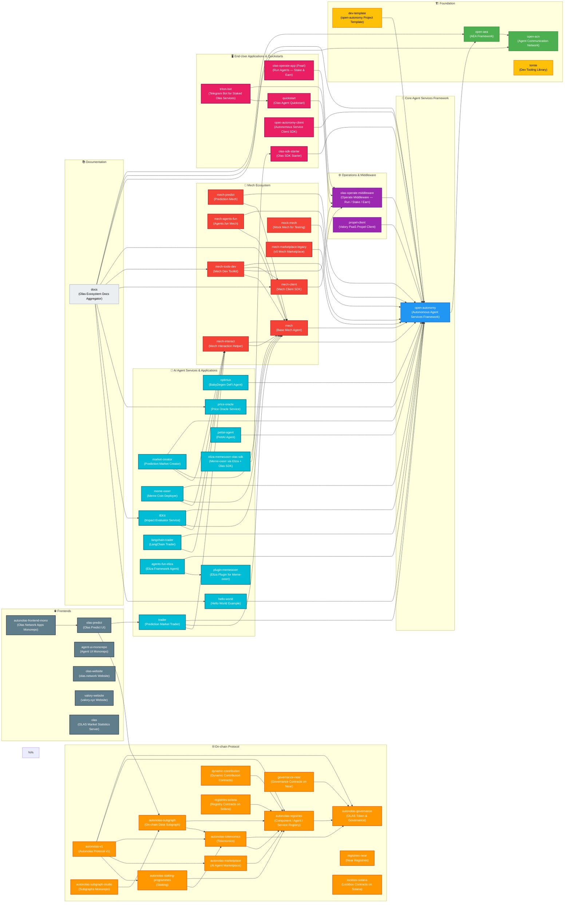

# Valory-xyz Repository Dependency Graph

```mermaid
flowchart LR

    %% ── Style Classes ──────────────────────────────────────────────────────────
    classDef foundation  fill:#4CAF50,color:#fff,stroke:#388E3C,stroke-width:2px
    classDef framework   fill:#2196F3,color:#fff,stroke:#1565C0,stroke-width:2px
    classDef onchain     fill:#FF9800,color:#fff,stroke:#E65100,stroke-width:2px
    classDef operations  fill:#9C27B0,color:#fff,stroke:#6A1B9A,stroke-width:2px
    classDef mecheco     fill:#F44336,color:#fff,stroke:#B71C1C,stroke-width:2px
    classDef agent       fill:#00BCD4,color:#fff,stroke:#006064,stroke-width:2px
    classDef enduser     fill:#E91E63,color:#fff,stroke:#880E4F,stroke-width:2px
    classDef frontend    fill:#607D8B,color:#fff,stroke:#263238,stroke-width:2px
    classDef devtools    fill:#FFC107,color:#000,stroke:#F57F17,stroke-width:2px
    classDef docs        fill:#ECEFF1,color:#000,stroke:#B0BEC5,stroke-width:2px

    %% ── Subgraph: Foundation ───────────────────────────────────────────────────
    subgraph FOUNDATION["🏗️ Foundation"]
        open_aea["open-aea<br>(AEA Framework)"]:::foundation
        open_acn["open-acn<br>(Agent Communication Network)"]:::foundation
        tomte["tomte<br>(Dev Tooling Library)"]:::devtools
        dev_template["dev-template<br>(open-autonomy Project Template)"]:::devtools
    end

    %% ── Subgraph: On-chain Protocol ─────────────────────────────────────────────
    subgraph ONCHAIN["⛓️ On-chain Protocol"]
        autonolas_v1["autonolas-v1<br>(Autonolas Protocol v1)"]:::onchain
        gov["autonolas-governance<br>(OLAS Token & Governance)"]:::onchain
        reg["autonolas-registries<br>(Component / Agent / Service Registry)"]:::onchain
        tok["autonolas-tokenomics<br>(Tokenomics)"]:::onchain
        stk["autonolas-staking-programmes<br>(Staking)"]:::onchain
        mkt["autonolas-marketplace<br>(AI Agent Marketplace)"]:::onchain
        near_reg["registries-near<br>(Near Registries)"]:::onchain
        dynamic_contribution["dynamic-contribution<br>(Dynamic Contribution Contracts)"]:::onchain
        governance_near["governance-near<br>(Governance Contracts on Near)"]:::onchain
        lockbox_solana["lockbox-solana<br>(Lockbox Contracts on Solana)"]:::onchain
        registries_solana["registries-solana<br>(Registry Contracts on Solana)"]:::onchain
        autonolas_subgraph["autonolas-subgraph<br>(On-chain Data Subgraph)"]:::onchain
        autonolas_subgraph_studio["autonolas-subgraph-studio<br>(Subgraphs Monorepo)"]:::onchain
    end

    %% ── Subgraph: Core Agent Services Framework ────────────────────────────────
    subgraph CORE["🤖 Core Agent Services Framework"]
        open_autonomy["open-autonomy<br>(Autonomous Agent Services Framework)"]:::framework
    end

    %% ── Subgraph: Operations & Middleware ──────────────────────────────────────
    subgraph OPS["⚙️ Operations & Middleware"]
        middleware["olas-operate-middleware<br>(Operate Middleware — Run / Stake / Earn)"]:::operations
        propel_client["propel-client<br>(Valory PaaS Propel Client)"]:::operations
    end

    %% ── Subgraph: Mech Ecosystem ───────────────────────────────────────────────
    subgraph MECH["🔧 Mech Ecosystem"]
        mech["mech<br>(Base Mech Agent)"]:::mecheco
        mech_predict["mech-predict<br>(Prediction Mech)"]:::mecheco
        mech_agents_fun["mech-agents-fun<br>(Agents.fun Mech)"]:::mecheco
        mech_client["mech-client<br>(Mech Client SDK)"]:::mecheco
        mech_tools_dev["mech-tools-dev<br>(Mech Dev Toolkit)"]:::mecheco
        mock_mech["mock-mech<br>(Mock Mech for Testing)"]:::mecheco
        mech_marketplace_legacy["mech-marketplace-legacy<br>(v0 Mech Marketplace)"]:::mecheco
        mech_interact["mech-interact<br>(Mech Interaction Helper)"]:::mecheco
    end

    %% ── Subgraph: AI Agent Services & Applications ─────────────────────────────
    subgraph AGENTS["🧠 AI Agent Services & Applications"]
        trader["trader<br>(Prediction Market Trader)"]:::agent
        market_creator["market-creator<br>(Prediction Market Creator)"]:::agent
        optimus["optimus<br>(BabyDegen DeFi Agent)"]:::agent
        memeooorr["meme-ooorr<br>(Meme Coin Deployer)"]:::agent
        iekit["IEKit<br>(Impact Evaluator Service)"]:::agent
        price_oracle["price-oracle<br>(Price Oracle Service)"]:::agent
        hello_world["hello-world<br>(Hello World Example)"]:::agent
        langchain_trader["langchain-trader<br>(LangChain Trader)"]:::agent
        pettai["pettai-agent<br>(PettAI Agent)"]:::agent
        agents_fun_eliza["agents-fun-eliza<br>(Eliza Framework Agent)"]:::agent
        eliza_memeooorr_sdk["eliza-memeooorr-olas-sdk<br>(Meme-ooorr via Eliza + Olas SDK)"]:::agent
        plugin_memeooorr["plugin-memeooorr<br>(Eliza Plugin for Meme-ooorr)"]:::agent
    end

    %% ── Subgraph: End-User Applications & Quickstarts ──────────────────────────
    subgraph ENDUSER["🖥️ End-User Applications & Quickstarts"]
        pearl["olas-operate-app (Pearl)<br>(Run Agents — Stake & Earn)"]:::enduser
        quickstart["quickstart<br>(Olas Agent Quickstart)"]:::enduser
        olas_sdk_starter["olas-sdk-starter<br>(Olas SDK Starter)"]:::enduser
        open_autonomy_client["open-autonomy-client<br>(Autonomous Service Client SDK)"]:::enduser
        triton_bot["triton-bot<br>(Telegram Bot for Staked Olas Services)"]:::enduser
    end

    %% ── Subgraph: Frontends ────────────────────────────────────────────────────
    subgraph FRONTEND["🌐 Frontends"]
        frontend_mono["autonolas-frontend-mono<br>(Olas Network Apps Monorepo)"]:::frontend
        olas_predict_fe["olas-predict<br>(Olas Predict UI)"]:::frontend
        agent_ui["agent-ui-monorepo<br>(Agent UI Monorepo)"]:::frontend
        olas_website["olas-website<br>(olas.network Website)"]:::frontend
        valory_website["valory-website<br>(valory.xyz Website)"]:::frontend
        olas_stats["olas<br>(OLAS Market Statistics Server)"]:::frontend
    end

    %% ── Subgraph: Documentation ────────────────────────────────────────────────
    subgraph DOCS["📚 Documentation"]
        docs["docs<br>(Olas Ecosystem Docs Aggregator)"]:::docs
    end

    %% ═══════════════════════════════════════════════════════════════════════════
    %% Dependencies
    %% ═══════════════════════════════════════════════════════════════════════════

    %% Core framework builds on open-aea
    open_autonomy --> open_aea

    %% open-aea uses open-acn for agent communication
    open_aea --> open_acn

    %% dev-template is a project template for open-autonomy
    dev_template --> open_autonomy

    %% On-chain contract hierarchy
    %% autonolas-v1 is a meta-repo that aggregates all on-chain protocol repos as submodules (.gitmodules)
    autonolas_v1 --> gov
    autonolas_v1 --> reg
    autonolas_v1 --> tok
    autonolas_v1 --> mkt
    autonolas_v1 --> stk
    reg --> gov
    tok --> gov
    tok --> reg
    stk --> reg
    stk --> tok
    mkt --> reg
    dynamic_contribution --> reg
    registries_solana --> reg
    governance_near --> gov
    autonolas_subgraph --> reg
    autonolas_subgraph --> tok
    autonolas_subgraph_studio --> autonolas_subgraph

    %% Operations middleware builds on open-autonomy
    middleware --> open_autonomy
    %% propel-client depends on open-autonomy directly (pyproject.toml: open-autonomy = "==v0.19.7")
    propel_client --> open_autonomy

    %% Mech ecosystem
    %% open-autonomy packages (via third_party in packages.json)
    mech --> open_autonomy
    mech_predict --> open_autonomy
    mech_agents_fun --> open_autonomy
    mock_mech --> open_autonomy
    mech_marketplace_legacy --> open_autonomy
    mech_client --> middleware
    mech_tools_dev --> open_autonomy
    mech_tools_dev --> mech_client
    mech_tools_dev --> middleware
    %% mech packages (via third_party in packages.json: acn_data_share, agent_mech, mech_abci, etc.)
    mech_predict --> mech
    mech_agents_fun --> mech
    mech_tools_dev --> mech
    %% mech-interact owns mech_interact_abci skill and depends on mech packages
    mech_interact --> open_autonomy
    mech_interact --> mech

    %% AI Agent Services build on open-autonomy (via third_party in packages.json)
    trader --> open_autonomy
    market_creator --> open_autonomy
    optimus --> open_autonomy
    memeooorr --> open_autonomy
    iekit --> open_autonomy
    price_oracle --> open_autonomy
    hello_world --> open_autonomy
    langchain_trader --> open_autonomy
    pettai --> open_autonomy
    agents_fun_eliza --> open_autonomy
    %% eliza-memeooorr-olas-sdk is based on olas-sdk-starter (empty packages.json; README is olas-sdk-starter template)
    eliza_memeooorr_sdk --> olas_sdk_starter
    %% plugin-memeooorr is a TypeScript/Eliza npm plugin designed for agents-fun-eliza (not a Python meme-ooorr dep)
    agents_fun_eliza --> plugin_memeooorr
    %% mech packages used directly (protocol/valory/acn_data_share, etc. in third_party)
    trader --> mech
    market_creator --> mech
    memeooorr --> mech
    iekit --> mech
    %% mech-interact packages used (skill/valory/mech_interact_abci in third_party)
    trader --> mech_interact
    market_creator --> mech_interact
    memeooorr --> mech_interact
    iekit --> mech_interact
    langchain_trader --> mech_interact

    %% End-user apps
    pearl --> middleware
    quickstart --> middleware
    olas_sdk_starter --> open_autonomy
    open_autonomy_client --> open_autonomy
    triton_bot --> middleware
    %% triton-bot points to trader_quickstart folders (config.yaml: paths to .operate directories)
    triton_bot --> quickstart

    %% Frontends
    frontend_mono --> olas_predict_fe
    %% olas-predict is the UI for the trader service and queries autonolas-subgraph via GraphQL
    olas_predict_fe --> trader
    olas_predict_fe --> autonolas_subgraph


    %% Documentation aggregates submodules (see docs/.gitmodules)
    docs --> open_aea
    docs --> open_autonomy
    docs --> open_acn
    docs --> mech
    docs --> mech_tools_dev
    docs --> mech_client
    docs --> price_oracle
    docs --> iekit
    docs --> hello_world

    %% ═══════════════════════════════════════════════════════════════════════════
    %% Repositories in the valory-xyz GitHub org NOT included in this diagram
    %% (❌ = archived; others are standalone, experimental, event-specific, or docs-only)
    %%
    %%  academy-learning-service             — Academy learning service (no public deps)
    %%  academy-learning-service-template    — Template for the academy learning service
    %%  academy-solutions                    — Academy exercise solutions
    %%  aea-babyagi                          — BabyAGI adaptation in Open AEA (standalone demo)
    %%  agent-academy-1                   ❌ — Agent Academy 1 participant repo
    %%  agent-academy-2                   ❌ — Agent Academy 2 participant repo
    %%  agent-stats                       ❌ — Agent statistics & parameters (JS tool)
    %%  ai-mech                           ❌ — AI Mech (predecessor to mech)
    %%  ai-registry-mech-frontend         ❌ — AI Mech Registry dApp
    %%  ai-registry-mech-graph            ❌ — AI registry mech graph (TypeScript tool)
    %%  airdrop-helper                       — Olas ecosystem participation measurement tool
    %%  apy-oracle                        ❌ — APY Oracle Service (agent service)
    %%  autonolas-aip                        — Autonolas Improvement Proposals (docs only)
    %%  autonolas-build-frontend          ❌ — build.olas.network frontend
    %%  autonolas-contribution-service-frontend ❌ — Contribution dApp
    %%  autonolas-frontend-library        ❌ — Autonolas frontend component library
    %%  autonolas-frontend-template       ❌ — Autonolas frontend template
    %%  autonolas-launch-frontend         ❌ — Autonolas launch frontend
    %%  autonolas-member-frontend         ❌ — member.olas.network frontend
    %%  autonolas-operate-frontend        ❌ — Operate dApp
    %%  autonolas-registry-frontend       ❌ — Registry dApp
    %%  autonolas-tokenomics-frontend     ❌ — Tokenomics dApp
    %%  autonolas-tokenomics-solana       ❌ — Solana Tokenomics contracts
    %%  autonolas-website                 ❌ — autonolas.network website
    %%  autonomous-fund                   ❌ — Autonomous Fund Manager (agent service)
    %%  celo-trader                       ❌ — Celo Trader agent
    %%  ceramic-py                        ❌ — Simple Ceramic Network Python client
    %%  co-owned-ai-website                  — co-owned.ai website
    %%  community-nfts                    ❌ — Community NFT contracts
    %%  contract-utils                    ❌ — Contract utilities
    %%  contracts-amm                     ❌ — AMM contracts
    %%  contracts-aks                     ❌ — Autonomous Keeper Service job registry
    %%  contribution-service              ❌ — Dynamic NFT Contribution Service (agent service)
    %%  decentralized-watchtower          ❌ — Decentralized watchtower service
    %%  dkg-predictions                   ❌ — DKG example on OriginTrail
    %%  el-collectooorr-frontend          ❌ — El Collectooorr front-end
    %%  elcollectooorr-contracts          ❌ — El Collectooorr smart contracts
    %%  erc20-token-bridge                ❌ — ERC-20 token bridge
    %%  eth-lisbon-23                     ❌ — ETH Lisbon 2023 hack (Shorts.wtf)
    %%  ethlisbon                         ❌ — ETH Lisbon ArtBlocks NFT agent
    %%  ethereum-optimism.github.io          — Fork of Optimism token list
    %%  generatooorr                      ❌ — Generatooorr agent service
    %%  gnosis-mech                       ❌ — Copy of gnosis/mech (original deleted)
    %%  governatooorr                     ❌ — AI Governance Delegate (agent service)
    %%  governatooorr-frontend            ❌ — governatooorr.autonolas.network frontend
    %%  governatooorr-solana              ❌ — Governatooorr on Solana
    %%  legacy-lockbox-solana             ❌ — Legacy Solana lockbox contracts
    %%  liquidity-rebalancing             ❌ — Liquidity rebalancing agent
    %%  mech-eth-lisbon-2023              ❌ — Shorts.wtf smart contracts (ETH Lisbon 2023)
    %%  mech-ethdenver-2024               ❌ — Mech extension for ETH Denver 2024
    %%  mech-offchain-eth-lisbon-2023     ❌ — Off-chain mech for ETH Lisbon 2023
    %%  mech-predict-markets              ❌ — Mech predict markets
    %%  mech-quickstart                   ❌ — Mech Quickstart
    %%  mech-tool-template                ❌ — Template for authoring new mech tools
    %%  modius-quickstart                 ❌ — Modius/DeFi Agent Quickstart
    %%  olas-predict-benchmark            ❌ — Olas Predict benchmark of Mech tools
    %%  open-operator-aks                 ❌ — Deploy Autonomous Keeper Agent on AWS
    %%  open-operator-watchtower          ❌ — Open operator watchtower
    %%  optimus-quickstart                ❌ — Optimus Quickstart
    %%  prediction-markets                ❌ — Prediction Markets Demo Monorepo
    %%  press-kit-valory                     — Valory brand guidelines / press kit
    %%  santa-nft                         ❌ — Valory Santa NFT 2021
    %%  scripts                           ❌ — Internal scripts
    %%  shorts-frontend                   ❌ — Shorts.wtf frontend (ETH Lisbon 2023)
    %%  solana-sandbox                    ❌ — Solana sandbox / experiments
    %%  test-deployment-envs              ❌ — Internal test deployment environments
    %%  trader-quickstart                 ❌ — Trader Quickstart
    %%  ZK-ML-Verifier                    ❌ — ZK-ML Verification Service (agent service)
    %% ═══════════════════════════════════════════════════════════════════════════
```