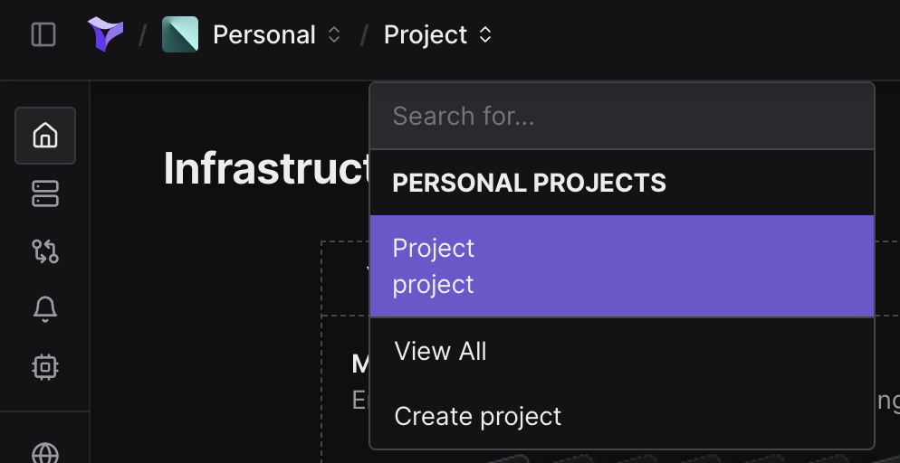
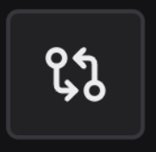
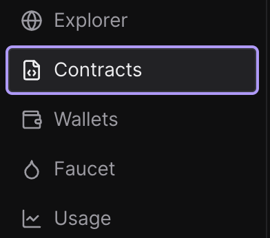

## **Overview** 

This guide contains guidelines for contributing to the development of Mechs and offer services.

In order to offer services, anyone can create and deploy their own Mech agents. First, developers can use existing pieces of code, called tools, or create and publish new ones. Once tools are created, Mech agents can be deployed on the Olas Registry. At this point, a Mech contract can be created via the [Mech MarketPlace](#appendix-what-is-the-mech-marketplace). Mech agents, when creating on-chain Mech contracts via the Mech Marketplace can choose among three distinct payment models, each defining how the requester can pay for the service requested Specifically, the payment models are the following:

- Native:  A fixed-price model where the requester pays using the chain with native token native token for each delivered service;

- Token: Similar to the Native model, but payments are made using a specified ERC20 token; 

- Nevermined subscription: A dynamic pricing model that allows flexible pricing across different services.

Mech agent deployment and related Mech contract creation process is handled by the Mech quickstart, and the main inputs to provide are the list of tools to be used, and the chosen payment model. 

The detailed instructions to create tools, test them locally and deploy a Mech agent, and accrue payments can be found below.
 

## 1. Creating and publishing a tool

In order to contribute to Mechs' abilities, you can create and publish a tool. In order to do so, follow the instructions below. 

### 1. 1. Creating a tool

**Requirements**: [Python](https://www.python.org/) >= 3.8; [Pip](https://pip.pypa.io/en/stable/installation/); [Pipenv](https://pipenv.pypa.io/en/latest/installation.html) >= 2001.x.xx ; [Docker Engine](https://docs.docker.com/engine/install/) ; [Docker Compose](https://docs.docker.com/compose/install/) 

In order to create a tool, the steps are as follows: 

**1.** Fork the repository https://github.com/valory-xyz/mech and clone the forked copy;

**2.** In the main folder, in terminal:

```
pip install open-autonomy
autonomy init --remote --ipfs --author <author_name> 
autonomy packages sync
```

**3.** Create a folder "username" [replace with your username] in the folder “packages”, inside this create a folder "customs", and inside this folder create a folder whose name corresponds to the tool. This folder should contain the following files : `component.yaml`, `tool_name.py` and `__init__.py`. For the second file, replace `tool_name` by the name of the tool.

```
cd packages
mkdir <username>
cd <username>
mkdir customs 
cd customs
mkdir <tool_name> 
cd <tool_name>
touch component.yaml
touch tool_name.py
touch __init__.py
```

For the third file, copy and paste the following copyright text found for instance [here](https://github.com/KahanMajmudar/mech/blob/main/packages/valory/connections/__init__.py). 

**4.** In `component.yaml`, copy and paste the following template (or the content of the `component.yaml` of any other tool), and replace the following fields: name (name of the module), author (name of the author), entry_point (this points at the python file in which the executable function is), callable (points at the function which is called in the entry_point), description (simple description of the module). In fingerprint, replace tool_name.py by the chosen entry point file.

```
name: tool_name
author: author_name
version: 0.1.0
type: custom
description: Tool description
license: Apache-2.0
aea_version: '>=1.0.0, <2.0.0'
fingerprint:
    __init__.py:
    tool_name.py:
fingerprint_ignore_patterns: []
entry_point: tool_name.py
callable: run
dependencies: {}
```

If the module has any dependencies, remove `{}` and add them in the following format: 

```
dependencies: 
    dependency_1:
        version: ==0.5.3
    dependency_2:
        version: '>=2.20.0'
```

**5.** Create the code for the tool in the file `tool_name.py` (following the examples of tools found [here](https://github.com/valory-xyz/mech-predict/tree/main/packages), for instance https://github.com/valory-xyz/mech-predict/tree/main/packages/gnosis/customs/ofv_market_resolver); the only requirement is to implement the function specified in callable of the `component.yaml` file; a minimal file would be the following for the template in the previous step for instance: 

```
def run(**kwargs):
    pass
```
	
This function needs to return the result of using the tool.

### 1. 2. Publishing the tool

**1.** Create the package hash, by running the following commands, from the root:

```
autonomy packages lock
```

At this point you will be prompted to choose "dev" or "third-part". Choose "dev".

**2.** Push the packages to IPFS: 

```
autonomy push-all
```

**3.** Mint the tool [here](https://registry.olas.network/ethereum/components/mint) as a component on the Olas Registry; For this is 
needed: an address (EOA), and the hash of the meta-data file. In order to generate this hash, click on “Generate Hash & File” and providing the following information: name (name of the tool); description (of the tool); version (this is found in the file `component.yaml`); package hash (this can be found in package.json in the packages folder, in the entry which corresponds to the created tool); NFT image URL (for instance on IPFS, supported domains are listed in the window). In order to push an image on IPFS, there are two possibilities: 

- Use this [script](https://github.com/dvilelaf/tsunami/blob/main/scripts/ipfs_pin.py). Place it in the main folder and place the image in the folder `mints` in the format `.jpg`. Then run the script: 
```
python ipfs_pin.py
```

- Clone the mech-client repository:
```
git clone https://github.com/valory-xyz/mech-client.git
cd mech-client
```
Then put the file in the mech-client folder and run the following in terminal, replacing `<file_name>` with the name of your file: 
```
mechx push-to-ipfs ./<file_name>
```

After this the tool can be deployed to be used by a [Mech](#2-testing-mech-locally). 


## 2. Testing a tool by deploying a Mech locally

In order to test a tool that you developed, it is possible to do this by deploying a Mech locally and send it 
requests, specifying your tool as the one to be used. In order to do so, follow the instructions below.

### 2. 1. Setup 

**Requirements**: [Python](https://www.python.org/) == `3.10`; [Poetry](https://python-poetry.org/docs/) >= `1.4.0` ; [Docker Engine](https://docs.docker.com/engine/install/) ; [Docker Compose](https://docs.docker.com/compose/install/) ; [Yarn](https://yarnpkg.com/) == `1.22.19` ; [Node](https://nodejs.org/en) == `20.18.1`; npx/npm == `10.8.2` ;

**1.** Run the followings in the terminal: 
```
docker pull valory/open-autonomy-tendermint:0.18.3
docker pull valory/oar-mech:bafybeicg5ioivs2ryaim6uf3cws2ashc5ldxtrvxgbjbhv3y2ic63qx324
```

**2.** Clone the mech-quickstart repository:

```
git clone https://github.com/valory-xyz/mech-quickstart.git
```

**3.** Rename the file `.api_keys.json.example` into `.api_keys.json` (don't change the dummy keys), and the file `.tools_to_packages_hash.json.example` into `.tools_to_packages_hash`. You can modify this example by adding your tool (name and hash).

**4.** Create a tenderly virtual testnet, following these steps: 

- Create an account/connect to Tenderly: https://dashboard.tenderly.co/. 

- Click on “Project” and then “Create project”, as on the following picture. 

      

      Give a name to the project and click again on “Create project”. 
    
- Then click on "Virtual Test Nets" on the left menu (or on the following icon if the menu bar is collapsed): 
      
    
- Then click on “Create Virtual TestNet”.

- Choose “Gnosis chain” as the parent network, give a name to the virtual testnet and un-mark “Use latest block” in the State Sync section in order to enter the following custom block: 36619660.
    
- Finally, click on the “Create” button.

- After you are redirected to the TestNet "Explorer" page, copy the RPC Admin HTTPS link, it will be used later.

**5.** Setup the virtual testnet, by following these steps: 

- In a separate folder, clone the ai-registry-mech repository: 
        ```
        git clone https://github.com/KahanMajmudar/ai-registry-mech.git
        ```
- Run the following: 
        ```
        git submodule update --init --recursive
        ```
- Then change the branch to "testnet-setup".

- Crate an access token on Tenderly, by clicking on the profile icon (top-right), then on "Account settings", "Access tokens" in the left menu, then "Generate access token". Choose a label (it is only informative) and then click on "Generate". Copy the generated token.  

- Connect to tenderly in the terminal: 
        ```
        tenderly login --access-key <access_token>
        ```
where `<access_token>` has to be replaced with the access key created as before.

- In the file `hardhat.config.js`, change the url of `virtual_testnet` (line 47) to the RPC of the testnet created on tenderly. On lines 141 and 142, change "project" and "username" strings with the ones found on tenderly in the opened project. This can be found by clicking on "Project" on the tenderly dashboard, then selecting the opened project, and "Settings" on the right menu. The "project" corresponds to "Project slug" and "username" corresponds to "Account slug".

- In the file `globals.json`, change "networkURL" on line 6 to the RPC of the testnet and "privateKey" (line 7) to the private key of your wallet. 

- Install the dependencies using the following: 
    ```
    yarn install
    ```

- Fund the EOA address in tenderly (with the default amount). In order to do so, click on “Fund account” on the webpage of the virtual testnet created before, enter the address to fund, the quantity and the token. For a custom token, click on “Use custom token address” and enter the token address. Then click on “Fund”.

- Run the script to deploy the contracts which are necessary to test the Mech locally: 
```
bash setup-tdly.sh
``` 
- From the file `globals.json` in the ai-registry-mech folder, copy the following values and paste them in the corresponding lines of the `utils.py` file of the mech-quickstart folder: 

    **a.** "mechMarketplaceProxyAddress" -> line 490 ; 

    **b.** "mechFactoryFixedPriceNativeAddress" -> line 495 ; 

    **c.** "mechFactoryFixedPriceTokenAddress" -> line 500.

### 2. 2. Running the Mech

**0.** Change folder to the mech-quickstart one and then create environment (in terminal): 

```
poetry shell
poetry install
```

**1.** Run the mech service (in terminal):

```
bash run_service.sh
```

**2.** Provide information when prompted, in particular: 

- "Please enter a GNOSIS RPC URL" -> enter the RPC endpoint (https address copied earlier). 

- "Which type of mech do you want to deploy?" -> this corresponds to the payment model of the Mech (Native: native token ; Token: ERC20 tokens; Nevermined: subscription); default is Native. 

Other values can be left to default (by pressing enter when prompted).

**3.** When prompted to do so, add funds to the required address. 

**4.** Logs are visible with: 
```
docker logs mech_abci_0 --follow
```

The activity of the Mech is visible on the virtual testnet.

**5.** Stop the mech service: 

```
./stop_service.sh
```

### 2. 3. Sending a request

**1.** In another folder, clone the mech-client repository: 

```
git clone https://github.com/valory-xyz/mech-client.git
```

**2.** Install the mech-client package: 

```
pip install -e.
```

**3.** If the mech-client folder does not contain a file `ethereum_private_key.txt` already, create it and paste in it the private key of your EOA.

**4.** Add the following at the end of the dictionary in `mech_client/configs/mechs.json`: 

```
"tdly": {
    "agent_registry_contract": "0x9dEc6B62c197268242A768dc3b153AE7a2701396",
    "service_registry_contract": "0x9338b5153ae39bb89f50468e608ed9d764b755fd",
    "rpc_url": ,
    "wss_endpoint": "wss://gnosis-chiado-rpc.publicnode.com",
    "ledger_config": {
        "address": ,
        "chain_id": 10200,
        "poa_chain": false,
        "default_gas_price_strategy": "eip1559",
        "is_gas_estimation_enabled": false
    },
    "mech_marketplace_config": {
        "mech_marketplace_contract": "",
        "priority_mech_address": "",
        "response_timeout": 300,
        "payment_data": "0x"
    },
    "gas_limit": 500000,
    "price": 10000000000000000,
    "contract_abi_url":"https://gnosis.blockscout.com/api/v2/smart-contracts/{contract_address}",
    "transaction_url":"https:/gnosisscan.iotx/{transaction_digest}",
    "subgraph_url": ""
}
```

Replace `rpc_url` and `address` with the RPC endpoint address, and `mech_marketplace_contract` with the mech marketplace address found in tenderly. Change also `priority_mech_address` with the address of your Mech (it can be found in `mech-quickstart/.mech_quickstart/local_config.json`, key `mech_address`). This address can be found in the tab "Contracts" of the page of the Testnet created above: 



The contract is the last one created in the list of contracts found in tenderly. 

**5.** Comment lines 560 to 566 in `mech_client/marketplace_interact.py`.

**6.** Run the following command in terminal in the mech-client repository: 

```
mechx interact <prompt> --tool <tool_name> --chain-config tdly
```

where `<prompt>` is replaced by the chosen prompt and `<tool_name>` by the name of your tool.

**7.** You can see the data of the request in the testnet page on tenderly, in the tab "Explorer".

## 4. Deploying a Mech on the Mech Marketplace (quickstart)

In order to register a Mech on the Mech Marketplace - including Mech service creation and deployment, and Mech contract deployment- follow the instructions below.

### 4. 1. Setup 

**Requirements**: [Python](https://www.python.org/) == 3.10; [Poetry](https://python-poetry.org/docs/) >= 1.4.0 ; [Docker Engine](https://docs.docker.com/engine/install/) ; [Docker Compose](https://docs.docker.com/compose/install/) 

**1.** Run the followings in the terminal: 

```
docker pull valory/open-autonomy-tendermint:0.18.3
docker pull valory/oar-mech:bafybeicg5ioivs2ryaim6uf3cws2ashc5ldxtrvxgbjbhv3y2ic63qx324
```

**2.** Create an EOA (add xDAI amounts on this account whenever requested). 

**3.** Create a RPC endpoint, for instance using https://www.nodies.app/. The steps are the following ones: 

- Create an account; 

- Create a project; 

- Add an app to this project (choose the Gnosis chain); 

- Copy the HTTPS link (under “Endpoint networks”) → this will be requested later; 

**5.** Create a Google API Key and an OpenAI API key. 

**6.** Clone the mech-quickstart repository:

```
git clone https://github.com/valory-xyz/mech-quickstart.git
```

**7.** Rename the file `.api_keys.json.example` into `.api_keys.json` and add OpenAI and Google API keys in the file. Also rename the file `.tools_to_packages_hash.json.example` into `.tools_to_packages_hash`. You can modify this example by adding your tool (name and hash).

**8.** Change folder to mech-quickstart and create environment (in terminal): 

```
cd mech-quickstart
poetry shell
poetry install
```

### 4. 2. Running the mech service

**1.** Run the mech service (in terminal):

```
bash run_service.sh
```

**2.** Provide information when prompted (in particular for the RPC endpoint, provide the https address copied earlier). Also add funds to the required address.

**3.** In order to send a request to it, follow the steps in the [section 2.3](#2-3-sending-a-request) above, replacing the RPC endpoint with the one created here. 

**4.** Logs are visible with: 

```
docker logs mech_abci_0 --follow
```

**5.** You can send a request, by changing the value of `priority_mech_address` in the dictionary of the chain chosen when setting up the RPC endpoint in `.mech_client/configs/mechs.json` by the address of your Mech. This address can be found in `.mech_quickstart/local_config.json`, key `mech_address`. Then use the mechx command: 

```
mechx interact <prompt> --tool <tool_name> --chain-config <chain>
```

where `<prompt>` is replaced by the chosen prompt and `<tool_name>` by the name of your tool, and `<chain>` is replaced by the 
name of the chosen chain.

**6.** In order to add new tools when the mech is deployed, add its name and hash in `.tools_to_packages_hash.json`.

**7.** Stop the mech service: 

```
./stop_service.sh
```

## 5. Deploying a Mech on the Mech Marketplace (manually)

In order to deploy a Mech, it is also possible to do so manually, first by deploying a service, registering it on the Mech Marketplace, and then running it locally.

### 5.1 Creating a Mech service

In order to create the service, go to the [Olas Registry](https://registry.olas.network/gnosis/services) webpage. 

**1.** Choose the network and connect your wallet. 

**2.** Click on the button "Mint".

**3.** Click on the `Prefill address` button in order to fill the `owner address` field. You will need to have funds on this address in order to deploy the service. For the hash of the metadata file, click on "Generate Hash & File". The hash should be the one found in the file `packages/packages.json` in the mech-predict [repository](https://github.com/valory-xyz/mech-predict/) for the key `service/valory/mech/`. Select first the prefix and fill the field with the remaining part. The version is contained in this key (e.g. `service/valory/mech/0.1.0`). For the agent id, follow the instructions on the opened page (we suggest agent id = 9 to test). The number of slots corresponds to the number of agents that the service contains (we suggest 1 to test). For the cost of agent bound, we suggest that you use a small value (e.g., 1000000000000000 GörliWei = 0.001 GörliETH). We suggest to write threshold = 1 to test. Then click on submit.

**4.** Click on "Services". The last entry corresponds to the service you have created. Click on "View".

**5.** Click first on "Activate registration" (Step 1). Then in the field "Agent Instance Addresses" (Step 2), enter one address (not the same one as the one used as owner address) for each agent in the service, and click on "Register Agents". Choose a service multisig (Step 3) and click on "Submit".

**6.** The service is now deployed, and you can see the safe contract address below. You will need this address in order to run the Mech.

### 5.2 Registering the service on the Mech Marketplace

In order to register your service on the Mech Marketplace, follow the instructions below.

**1.** Find [there](https://github.com/valory-xyz/ai-registry-mech/blob/main/docs/configuration.json) the address of MechMarketPlaceProxy for the chosen network.

**2.** Using the scan of the chosen network, trigger the function `create` of this contract with the following inputs (in order):

- The service id.
- The Mech Factory address for the selected network and payment model. To find the correct address, refer to the [configuration file](https://github.com/valory-xyz/ai-registry-mech/blob/main/docs/configuration.json). Search for the address that matches the chosen payment model:

    - For Native, look for the MechFactoryFixedPriceNative address.

    - For Token: MechFactoryFixedPriceToken

    - For Nevermined, find MechFactoryNvmSubscriptionNative.

- The maximum price of the Mech (also called maxDeliveryRate), converted to Wei. In order to do this, first multiply 
the price in xDAI by 10^18. For instance, for a price of 1 xDAI, this 
is equal to 10^18. Then Use [ABI Hashex Encoder](https://abi.hashex.org/). Select uint256 as the type and enter the obtained value (for 1 xDAI this is 1000000000000000000 in wei). The tool will generate the encoded result, which is the following in the example: 0000000000000000000000000000000000000000000000000de0b6b3a7640000. Finally add 0x at the beginning of the sequence to obtain 0x0000000000000000000000000000000000000000000000000de0b6b3a7640000 in the example. This is the sequence that should be entered. 

:warning: You must use the same EOA as the one used to deploy the service.

### 5.3 Running the Mech service

In order to run the Mech service that you created, follow the steps below.

Clone the `mech-predict` repository:

```
git clone https://github.com/valory-xyz/mech-predict.git
```

Then follow the instructions in the README.md file (section 'Running the old base mech').

## 6. How to accrue the payments

In order to accrue the payments of your Mech, find [there](https://github.com/valory-xyz/ai-registry-mech/blob/main/docs/configuration.json) the BalanceTracker contract which corresponds to the payment model of your Mech. The key is the following for each of the three payment models: 

- Native: BalanceTrackerFixedPriceNative

- Token: BalanceTrackerFixedPriceToken

- Nevermined: BalanceTrackerNvmSubscriptionNative

Enter its address in the scan of the chosen network. Click on "Contract" and then "Write Contract" and trigger the function processPaymentByMultisig. Enter the address of your Mech and click on "Write". This will transfer the funds stored in the Mech Marketplace to the address of your Mech contract. 

## Appendix : What is the Mech Marketplace ?

The Mech Marketplace is a collection of smart contracts designed to facilitate seamless interactions between agents or applications (referred to as requesters) and Mech agents which provide task-based services. Essentially, it acts as a relay, enabling secure, on-chain payments while ensuring efficient task requests and service delivery. 

Specifically, the Mech Marketplace enables the following.

- **Effortless Mech contract creation and delivery**: Any agent registered on the Olas Service registry can quickly deploy a Mech contract with minimal inputs. This streamlined process allows agents to rapidly offer their service and receive on-chain payments.

- **Seamless task execution requests**: Requesters—whether agents or applications—can opt to directly submit service requests through the Mech Marketplace. The on-chain contracts manage payments, ensuring a smooth and transparent interaction between requesters and Mech agents.

- **Guaranteed task completion**: A take-over mechanism is in place: if a designated Mech fails to respond within a deadline specified by the requester, any other available Mech can step in to complete the task. Therefore, there is a high likelihood that every request is fulfilled, maintaining the system’s reliability.
Karma - A reputation score system: The Karma contract tracks each Mech’s performance by maintaining a reputation score. This reflects how often a Mech successfully completes assigned tasks versus how often it fails. Mech agents that maintain high Karma scores are considered more trustworthy by requesters. Assuming honest participation, Mech agents that maintain high Karma scores are considered more trustworthy by requesters.

- **Competitive environment**: Mechs are incentivized to deliver outstanding results promptly in order to maintain high Karma scores and secure more tasks.

