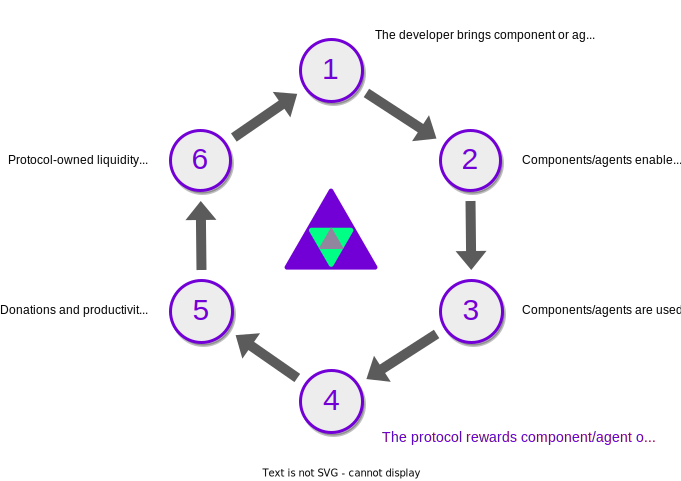

# Autonolas Protocol

<figure markdown>
{ align=left width="150" }
</figure>

The on-chain **Autonolas Protocol** anchors the Autonolas autonomous services -and in particular the current incarnation as agent services- on the target settlement layer and provides the primitives needed to create, operate and secure such services.
The protocol also provides a mechanism that incentivizes their creation and **rewards developers and service operators proportionally for their efforts to support the growth of the Autonolas ecosystem**.

<figure markdown>

</figure>

Autonolas strives to incentivize software composability and reusability. Thus, the Autonolas Protocol reflects such composability by representing software components as NFTs, and incorporates a mechanism that enables combining them to take into account their actual software composition relationship. This is a crucial feature to measure their contribution and reward accordingly to the tokenomics model.

The Autonolas Protocol is [currently deployed](./technical_overview.md#contract-addresses) in Ethereum and Görli chains, and it will be progressively deployed in all major blockchains.

!!! abstract "Learn more"

    Read the **Technical Architecture**, **Tokenomics** and **Governance** sections in the [Autonolas Whitepaper](https://www.autonolas.network/documents/whitepaper/Whitepaper%20v1.0.pdf) for the full details of the **Autonolas Protocol**.
