# Autonolas Protocol

<figure markdown>
{ align=left width="150" }
</figure>

The **Autonolas Protocol** is a collection of smart contracts that implements the mechanism to secure open-source code on-chain, and provides incentives to developers proportionally for their efforts in supporting the growth of the Autonolas ecosystem. The protocol is built with the {{open_autonomy}} framework in mind as the primary framework for realizing agent services,  alternative frameworks can also be used.

There are three main elements that make up the protocol:

* The **On-Chain Registry** anchors Autonolas autonomous services on-chain, and provides the primitives needed to create, operate and secure such services.

* The **Tokenomics** defines economic model facilitated by the Autonolas token. This is a mechanism to grow the capital deployed in services and reward developers.

* The **Governance** defines the rules of Autonolas as a decentralized, autonomous
organization (DAO), which is governed by the community.

<figure markdown>

</figure>

Autonolas strives to incentivize software composability and reusability. Thus, the Autonolas Protocol reflects such composability by representing software components as NFTs, and incorporates a mechanism that enables combining them to take into account their actual software composition relationship. This is a crucial feature to measure their contribution and reward according to the protocol tokenomics model.

<figure markdown>

</figure>

The Autonolas Protocol is [currently deployed](./registry_technical_overview.md#contract-addresses) in Ethereum and Görli chains, and it will be progressively deployed in all major blockchains.

!!! abstract "Learn more"

    Read the **Technical Architecture**, **Tokenomics** and **Governance** sections in the [Autonolas Whitepaper](https://www.autonolas.network/documents/whitepaper/Whitepaper%20v1.0.pdf) for the full details of the **Autonolas Protocol**.