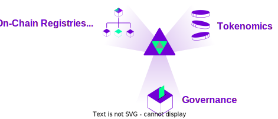

# Autonolas Protocol

<figure markdown>
{ align=left width="150" }
</figure>

The **Autonolas Protocol** is a collection of smart contracts that implements a mechanism to coordinate, secure, and manage software code on a public blockchain, and provides incentives to developers proportionally to their relative contribution to the growth of the Autonolas ecosystem. The protocol is built with the {{open_autonomy}} framework in mind as the primary framework for realizing agent services,  alternative frameworks can also be used.

The Autonolas Protocol is [currently deployed](./registry_technical_overview.md#contract-addresses) on Ethereum mainnet and Görli testnet, and it will be eventually deployed on all major smart-contract blockchains.

## Components

There are three main elements that make up the protocol:

<figure markdown>
{ align=left }
</figure>

* **On-Chain Registries** that allow for registering autonomous services, software agents and agent components (existing as a code off-chain) in the form of NFTs on-chain, and providing the primitives needed to combine components into agents, agents into autonomous services, and to operate and secure such autonomous services.

* The protocol **Tokenomics** defines an economic model that uses the [OLAS token](https://etherscan.io/token/0x0001A500A6B18995B03f44bb040A5fFc28E45CB0) as a coordination mechanism to accomplish three main objectives:

    * Enable the pairing of capital and code in a permissionless manner.
    * Create a flywheel that attracts increasingly more value and provides truly-decentralized autonomous services, owned by a DAO, operated by ecosystem actors, and coded by the ecosystem developers.
    * Incentivize software composability.

* **Governance**  allows the Autonolas DAO as a decentralized, autonomous
organization (DAO), to steer and fine-tune aspects of the Autonola protocol overtime.

!!! abstract "Learn more"

    Read the **Technical Architecture**, **Tokenomics** and **Governance** sections in the [Autonolas Whitepaper](https://www.autonolas.network/documents/whitepaper/Whitepaper%20v1.0.pdf) for the full details of the **Autonolas Protocol**.

## Rationale

In most settings, the reward model for service owners and agent operators is usually straightforward: users remunerate service owners, and service owners remunerate operators supporting their service. However it is not always well-defined how this is propagated to open-source software developers. This is where the Autonolas Protocol plays its role.

Autonolas strives to propose a model where open-source developers benefit from their contributions to the community by incentivizing software **composability**, **reusability** and **utility**. Software packages (components and agents) brought to the Autonolas ecosystem are secured and minted as NFTs in the Autonolas protocol. These packages can be used to compose agents and services, and the protocol has mechanisms to unambiguously represent the actual software/system composition on-chain. This is a crucial feature to [measure the utility](https://github.com/valory-xyz/autonolas-tokenomics/blob/main/docs/Autonolas_tokenomics_audit.pdf) of the code brought by developers and provide a fair reward for their contributions.

<figure markdown>

</figure>
