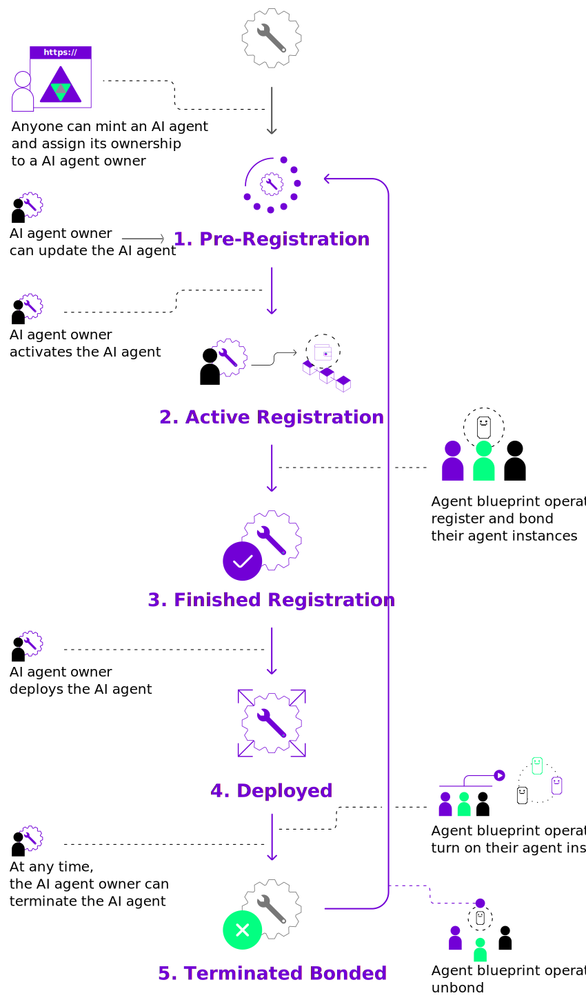

The life cycle of a service minted in the Autonolas Protocol consists of the following stages:

1. Pre-Registration
2. Active Registration
3. Finished Registration
4. Deployed
5. Terminated Bonded

!!! example

    Look at [this service]({{ autonolas_protocol_registry_dapp_link }}/ethereum/services/1) on the Autonolas Protocol web app to see the current state of a live service.

The figure below summarizes the life cycle and the actions that provoke a transition between states. Most of the service state transitions are initiated by the service owner. However, some state transitions are also triggered automatically. For example, when an operator registers the last available agent instance in the _Active Registration_ state, the service will automatically transit to the _Finished Registration_ state.

<figure markdown>
{ align=left width=650 }
</figure>

## Service states

This section details the states of a service minted in the Autonolas Protocol, as well as how to transit between them. You need to connect your wallet to the {{ autonolas_protocol_registry_dapp }} in order to execute the available actions in each state. The connected wallet will ask to approve any transaction.

### Pre-Registration

A service that [has just been minted](./mint_packages_nfts.md#mint-a-service) will be in _Pre-Registration_ (of agent instances) state.

Available actions:

* **Update.** The service owner can make amendments on [some parameters of the service](./mint_packages_nfts.md#mint-a-service).
* **Activate registration.** The service owner can transit the service to the _Active Registration_ state.

### Active Registration

The service is waiting for agent operators to register their agent instances.

Available actions:

* **Register agents.** Agent operators can register their agent instances in the service by specifying their addresses (starting with `0x...`). When the last agent instance slot is filled, the service will transit to the _Finished Registration_ state automatically.

    !!! warning "Important"

        When registering agent instance addresses for a service, some conditions have to be met:

        * The operator address (that is, the address of the wallet used to submit the registration transaction) must be different from the agent instance address(es) being registered.
        * The operator address must not be used as agent instance address in any other service.
        * The agent instance address(es) being registered must not be registered in any other service. In order to reuse an agent instance address, the service owner must terminate and unbond them from the service where they are registered.

* **Terminate.** The service owner can terminate the service, which will transit to the _Terminated Bonded_ state (or to the _Pre-Registration_ state if no agent instance has been registered yet).

### Finished Registration

All agent instance slots have been filled. Waiting for the service owner to continue deploying the service.

Available actions:

* **Deploy.** The service owner can deploy the [Safe](https://gnosis-safe.io/) multisig contract that will be associated with the service. The parameters shown in the deploy form are related to the creation of the safe (check the `setup` method [here](https://github.com/safe-global/safe-contracts/blob/main/contracts/Safe.sol)). If you are not familiar with the setup of such contracts, simply leave the default values. The service will transit to the _Deployed_ state.
* **Terminate.** The service owner can terminate the service, which will transit to the _Terminated Bonded_ state.
  
### Deployed

Congratulations! Your service is now in the _Deployed_ state!

The service is in its default operational state. Agent operators can turn on their agent instances at this point.

Available actions:

* **Terminate.** The service owner can terminate the service, which will transit to the _Terminated Bonded_ state.

### Terminated Bonded

The service has been terminated by the service owner. Waiting for the service owner to unbond all registered agents.

Available actions:

* **Unbond.** The service owner can unbond the registered agent instances. The service will transit to the _Pre-Registration_ state, enabling the registration of new agent instances.
