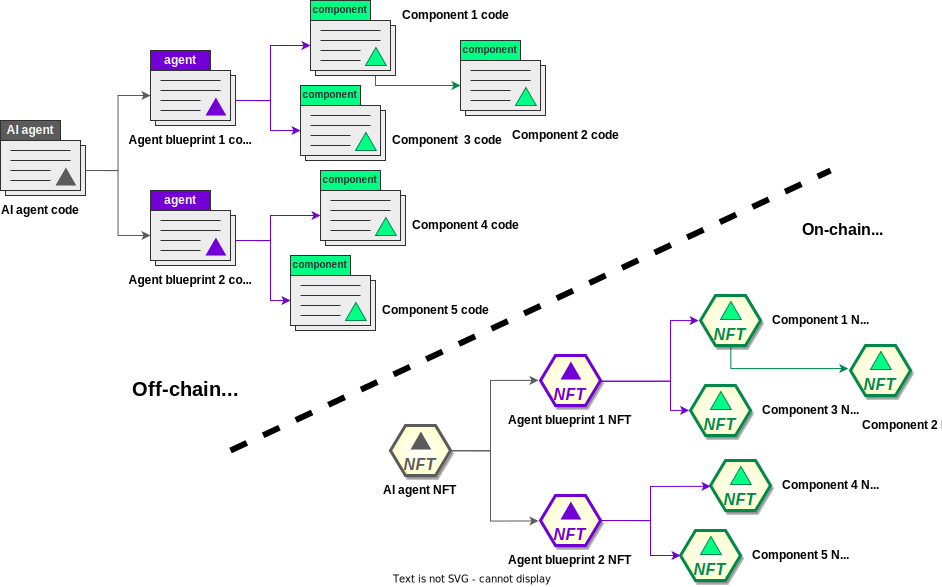
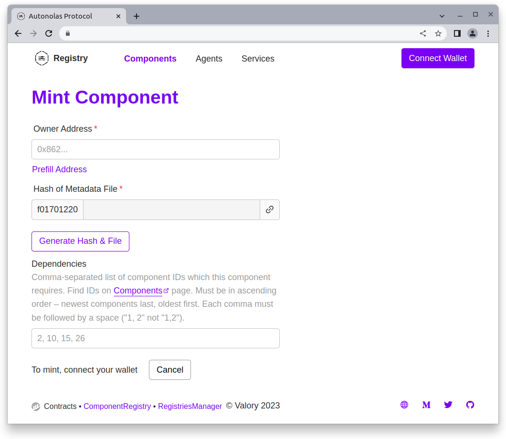
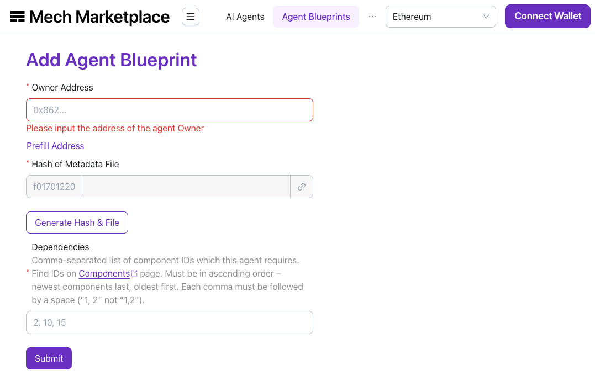
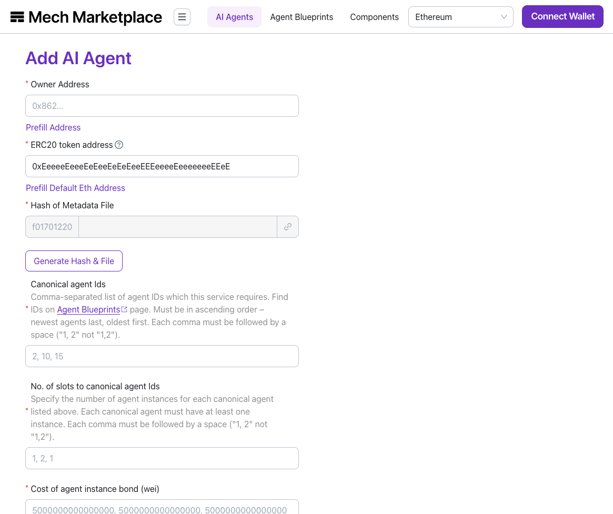

This guide describes how to use the {{ autonolas_protocol_registry_dapp }} to mint software packages NFTs in the Autonolas Protocol. You can mint three types of packages: **services**, **agents** and **components**.

## How packages are minted

To mint a package (also referred to as _unit_) in the protocol, it must have been published into a remote IPFS registry. Read [how to publish packages](https://docs.autonolas.network/open-autonomy/guides/publish_fetch_packages/) with the {{open_autonomy}} framework.

Minting a software package involves creating a **metadata file** that contains the package data and a pointer to the IPFS where the package is published.
The {{ autonolas_protocol_registry_dapp }} will automatically create and publish the metadata file on the IPFS registry, based on the package/unit information provided by the user in an online form. Then, it will interact with the protocol smart contracts to complete minting the package on-chain.

Upon completing the minting process, you will have an NFT representing your package in the Autonolas Protocol. See the figure below.

<figure markdown>

</figure>

Minted NFTs offer an on-chain representation of the relationship between different software packages by mirroring their dependency relations. This helps the protocol [Tokenomics](./tokenomics.md) to compute appropriate incentives, for example, based on how often a component is referenced.

<figure markdown>

</figure>

## Requirements

In order to mint a software package as an NFT, you must ensure that you have:

* An **address** associated to either

  * a crypto wallet (e.g., [Metamask](https://metamask.io/) or
  * a multisig contract (like [Safe](https://safe.global/)) which allows to connect via [Wallet Connect](https://walletconnect.com/).
  
    In either case, the address must have funds for the chain that you wish to mint the package NFT.

* The **hash of the package** that you want to mint on-chain, and which must have been published into a remote registry.

* An **NFT image URL**. This image will be used to represent the minted NFT for the package on marketplaces such as [OpenSea](https://opensea.io/). You can use [this sample image URL](https://gateway.autonolas.tech/ipfs/Qmbh9SQLbNRawh9Km3PMEDSxo77k1wib8fYZUdZkhPBiev) for testing purposes.

## Mint a component

Connect your wallet to the {{ autonolas_protocol_registry_dapp }}, open the [components section]({{ autonolas_protocol_registry_dapp_link }}/ethereum/components) and press the _Mint_ button. Fill in the data of your component:

<figure markdown>
{ align=left width=450 }
</figure>

  1. **Owner Address.** The wallet address of the component owner (starting with `0x...`). It does not need to be the address of the connected wallet.

  2. **Generate IPFS hash of the metadata file.** Press the _Generate Hash & File_ button and fill in the following data:

      * **Name.** The name of the component.
      * **Description.** A description of the component.
      * **Version.** The component version, in the format, `<major>.<minor>.<patch>`.
      * **Package hash.** The remote registry package hash starting with `bafybei...` obtained when the component was published in the remote registry.
      * **NFT Image URL.** An URL pointing to an image. You can use [this sample image URL](https://gateway.autonolas.tech/ipfs/Qmbh9SQLbNRawh9Km3PMEDSxo77k1wib8fYZUdZkhPBiev) for testing purposes.

      By pressing the _Save File & Generate Hash_ button, a metadata file with this information will be automatically generated and uploaded to the remote registry. You will notice that the hash will be populated in the component online form.

  3. **Dependencies.** Comma-separated list of component IDs which the component requires. You can find the IDs by browsing the [components section]({{ autonolas_protocol_registry_dapp_link }}/ethereum/components).

Press the _Submit_ button. Your wallet will ask you to approve the transaction. Once the transaction is settled, you should see a message indicating that the component NFT has been minted successfully.

## Mint an agent

Connect your wallet to the {{ autonolas_protocol_registry_dapp }}, open the [agents section]({{ autonolas_protocol_registry_dapp_link }}/ethereum/agents) and press the _Mint_ button. Fill in the data of your agent:

<figure markdown>
{ align=left width=450 }
</figure>

  1. **Owner Address.** The wallet address of the agent owner (starting with `0x...`). It does not need to be the address of the connected wallet.

  2. **Generate IPFS hash of the metadata file.** Press the _Generate Hash & File_ button and fill in the following data:

      * **Name.** The name of the agent.
      * **Description.** A description of the agent.
      * **Version.** The agent version, in the format, `<major>.<minor>.<patch>`.
      * **Package hash.** The remote registry package hash starting with `bafybei...` obtained when the agent was published in the remote registry.
      * **NFT Image URL.** An URL pointing to an image. You can use [this sample image URL](https://gateway.autonolas.tech/ipfs/Qmbh9SQLbNRawh9Km3PMEDSxo77k1wib8fYZUdZkhPBiev) for testing purposes.

      By pressing the _Save File & Generate Hash_ button, a metadata file with this information will be automatically generated and uploaded to the remote registry. You will notice that the hash will be populated in the agent online form.

  3. **Dependencies.** Comma-separated list of component IDs which the agent requires. You can find the IDs by browsing the [components section]({{ autonolas_protocol_registry_dapp_link }}/ethereum/components).

Press the _Submit_ button. Your wallet will ask you to approve the transaction. Once the transaction is settled, you should see a message indicating that the agent NFT has been minted successfully.

## Mint a service

Connect your wallet to the {{ autonolas_protocol_registry_dapp }}, open the [services section]({{ autonolas_protocol_registry_dapp_link }}/ethereum/services) and press the _Mint_ button. Fill in the data of your service:

<figure markdown>
{ align=left width=450 }
</figure>

  1. **Owner Address.** The wallet address of the service owner (starting with `0x...`). It does not need to be the address of the connected wallet.

  2. **Generate IPFS hash of the metadata file.** Press the _Generate Hash & File_ button and fill in the following data:

      * **Name.** The name of the service.
      * **Description.** A description of the service.
      * **Version.** The service version, in the format, `<major>.<minor>.<patch>`.
      * **Package hash.** The remote registry package hash starting with `bafybei...` obtained when the service was published in the remote registry.      * **NFT Image URL.** An URL pointing to an image. You can use [this sample image URL](https://gateway.autonolas.tech/ipfs/Qmbh9SQLbNRawh9Km3PMEDSxo77k1wib8fYZUdZkhPBiev) for testing purposes.

      By pressing the _Save File & Generate Hash_ button, a metadata file with this information will be automatically generated and uploaded to the remote registry. You will notice that the hash will be populated in the service online form.

  3. **Canonical agent Ids.** Comma-separated list of agent IDs which the service requires. You can find the IDs by browsing the [agents section]({{ autonolas_protocol_registry_dapp_link }}/ethereum/agents).

  4. **No. of slots to canonical agent Ids.** Specify the number of agent instances for each agent ID listed above.

  5. **Cost of agent instance bond.** Specify (in Wei units) what is the bond per each agent instance  joining the service. If you are using it for testing purposes, we suggest that you use a small value (e.g., 1000000000000000 GörliWei = 0.001 GörliETH).

  6. **Threshold.** Specify the threshold of agents required to sign.

Press the _Submit_ button. Your  wallet will ask you to approve the transaction. Once the transaction is settled, you should see a message indicating that the service NFT has been minted successfully. You should also see that the service is in _Pre-Registration_ state.

Once the service NFT has been minted, you can [manage the life cycle of the service](./life_cycle_of_a_service.md).
