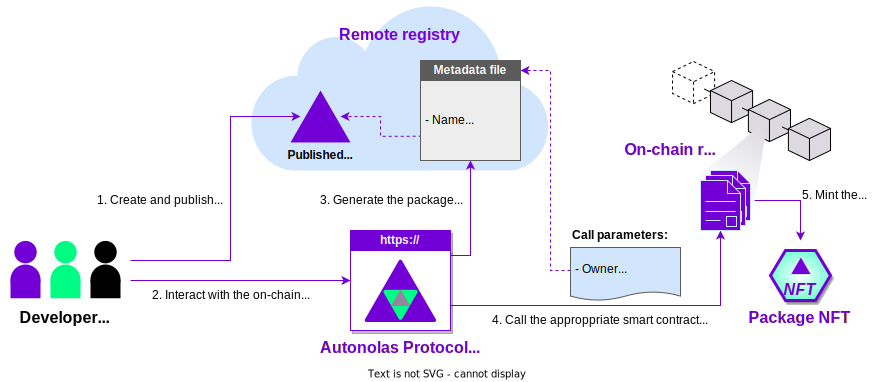

This guide describes how to use the [Autonolas Protocol web app](https://protocol.autonolas.network/) to register software packages. You can register three types of packages in the Autonolas Protocol: **services**, **agents** and **components**.

## How packages are registered

To register a package (also referred to as _unit_) in the protocol, it must have been published into a remote IPFS registry. Read [how to publish packages](https://docs.autonolas.network/open-autonomy/guides/publish_fetch_packages/) with the {{open_autonomy}} framework.

Registering a package involves creating a **metadata file** and filling in some data. The metadata file contains a pointer to the IPFS hash of the published software package.
This metadata file is also stored in the IPFS registry. The [Autonolas Protocol web app](https://protocol.autonolas.network/) will automatically create and publish the metadata file based on the package/unit information and the information provided in the registration form. Then, it will interact with the protocol smart contracts to complete the registration of your package on-chain.

Upon completing the registration process, you will have minted an NFT representing your package. See the figure below.

<figure markdown>

</figure>

## Requirements

In order to register a software package, you must ensure that you have:

* An **address** associated to either

    * a crypto wallet (e.g., [Metamask](https://metamask.io/) or a cold wallet), or
    * a multisig contract (like [Safe](https://safe.global/)) which allows to connect via [Wallet Connect](https://walletconnect.com/).
  
    In either case, the address must have funds for the chain that you wish to register the package.

* The **hash of the package** that you want to register on-chain, and which must have been published into a remote registry.

* An **NFT image URL**. This image will be used to represent the minted NFT for the package on marketplaces such as [OpenSea](https://opensea.io/). You can use [this sample image URL](https://gateway.autonolas.tech/ipfs/Qmbh9SQLbNRawh9Km3PMEDSxo77k1wib8fYZUdZkhPBiev) for testing purposes.

## Register a component

Connect your wallet to the Protocol app, open the [components section](https://protocol.autonolas.network/components) and press the _Register_ button. Fill in the data of your component:

  1. **Owner Address.** The wallet address of the component owner (starting with `0x...`). It does not need to be the address of the connected wallet.

  2. **Generate IPFS hash of the metadata file.** Press the _Generate Hash & File_ button and fill in the following data:

      * **Name.** The name of the component.
      * **Description.** A description of the component.
      * **Version.** The component version, in the format, `<major>.<minor>.<patch>`.
      * **Package hash.** The remote registry package hash starting with `bafybei...` obtained when the component was published in the remote registry.
      * **NFT Image URL.** An URL pointing to an image. You can use [this sample image URL](https://gateway.autonolas.tech/ipfs/Qmbh9SQLbNRawh9Km3PMEDSxo77k1wib8fYZUdZkhPBiev) for testing purposes.

      By pressing the _Save File & Generate Hash_ button, a metadada file with this information will be automatically generated and uploaded to the remote registry. You will notice that the hash will be populated in the component registration form.

  3. **Dependencies.** Comma-separated list of component IDs which the component requires. You can find the IDs by browsing the [components section](https://protocol.autonolas.network/components).

Press the _Submit_ button. Your wallet will ask you to approve the transaction. Once the transaction is settled, you should see a message indicating that the component has been registered successfully.

## Register an agent

Connect your wallet to the Protocol app, open the [agents section](https://protocol.autonolas.network/agents) and press the _Register_ button. Fill in the data of your agent:

  1. **Owner Address.** The wallet address of the agent owner (starting with `0x...`). It does not need to be the address of the connected wallet.

  2. **Generate IPFS hash of the metadata file.** Press the _Generate Hash & File_ button and fill in the following data:

      * **Name.** The name of the agent.
      * **Description.** A description of the agent.
      * **Version.** The agent version, in the format, `<major>.<minor>.<patch>`.
      * **Package hash.** The remote registry package hash starting with `bafybei...` obtained when the agent was published in the remote registry.
      * **NFT Image URL.** An URL pointing to an image. You can use [this sample image URL](https://gateway.autonolas.tech/ipfs/Qmbh9SQLbNRawh9Km3PMEDSxo77k1wib8fYZUdZkhPBiev) for testing purposes.

      By pressing the _Save File & Generate Hash_ button, a metadada file with this information will be automatically generated and uploaded to the remote registry. You will notice that the hash will be populated in the agent registration form.

  3. **Dependencies.** Comma-separated list of component IDs which the agent requires. You can find the IDs by browsing the [components section](https://protocol.autonolas.network/components).

Press the _Submit_ button. Your wallet will ask you to approve the transaction. Once the transaction is settled, you should see a message indicating that the agent has been registered successfully.

## Register a service

Connect your wallet to the Protocol app, open the [services section](https://protocol.autonolas.network/services) and press the _Register_ button. Fill in the data of your service:

  1. **Owner Address.** The wallet address of the service owner (starting with `0x...`). It does not need to be the address of the connected wallet.

  2. **Generate IPFS hash of the metadata file.** Press the _Generate Hash & File_ button and fill in the following data:

      * **Name.** The name of the service.
      * **Description.** A description of the service.
      * **Version.** The service version, in the format, `<major>.<minor>.<patch>`.
      * **Package hash.** The remote registry package hash starting with `bafybei...` obtained when the service was published in the remote registry.      * **NFT Image URL.** An URL pointing to an image. You can use [this sample image URL](https://gateway.autonolas.tech/ipfs/Qmbh9SQLbNRawh9Km3PMEDSxo77k1wib8fYZUdZkhPBiev) for testing purposes.

      By pressing the _Save File & Generate Hash_ button, a metadada file with this information will be automatically generated and uploaded to the remote registry. You will notice that the hash will be populated in the service registration form.

  3. **Canonical agent Ids.** Comma-separated list of agent IDs which the service requires. You can find the IDs by browsing the [agents section](https://protocol.autonolas.network/agents).

  4. **No. of slots to canonical agent Ids.** Specify the number of agent instances for each agent ID listed above.

  5. **Cost of agent instance bond.** Specify (in wei units) what is the bond per each agent instance  joining the service. If you are using it for testing purposes, we suggest that you use a small value (e.g., 1000000000000000 GörliWei = 0.001 GörliETH).

  6. **Threshold.** Specify the threshold of agents required to sign.

Press the _Submit_ button. Your  wallet will ask you to approve the transaction. Once the transaction is settled, you should see a message indicating that the service has been registered successfully. You should see that the service is in _Pre-Registration_ state.

Once it has been registered, you can [manage the life cycle of a service](./life_cycle_of_a_service.md).
