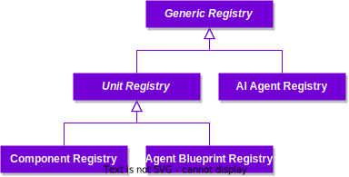
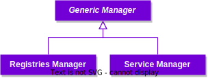

The **Autonolas Protocol** benefits from a modular design with a clear separation of concerns and opportunity for extensibility without compromising its security and permissionless nature. From an architectural point of view, the smart contracts that make up the protocol satisfy the following properties:

* Follow a core-periphery architecture (such as in [Uniswap](https://docs.uniswap.org/contracts/v2/concepts/protocol-overview/smart-contracts)), which allows for changing out periphery functionality without changing the data models at the core.
* Allow for extension via modules (such as in [MakerDAO](https://docs.makerdao.com/)).

Examples of modules include governance and staking. Governance is particularly important in a modular system, as it is used to vote on the adoption or abandoning of modules. By ensuring an immutable core, the Autonolas protocol provides guarantees that once created, the ecosystem’s agent components, canonical agents, and services are not mutable by governance – an important guarantee of censorship resistance.

The Autonolas Protocol is built with the {{open_autonomy}} framework in mind as the primary framework for realizing agent services. However, it does not enforces the usage of the {{open_autonomy}} framework, and it allows for services to be implemented on alternative frameworks.

!!! abstract "Learn more"

    Read the **Technical Architecture**, **Tokenomics** and **Governance** sections in the [Autonolas Whitepaper](https://www.autonolas.network/documents/whitepaper/Whitepaper%20v1.0.pdf) for the full details of the **Autonolas Protocol**.

## Registry

This section gives an overview on the technical details of the Autonolas Protocol Registry, where NFTs representing software packages can be minted.

### Core smart contracts

Core smart contracts are permissionless. Autonolas governance controls the process of service management functionalities and of minting new NFTs representing components and agents (i.e. it can change the minting rules and pause minting). The remaining functionalities, in particular transfer functionalities, are not pausable by governance.

<figure markdown>

</figure>

**Generic Registry**
:	An abstract smart contract for the generic registry template which inherits the Solmate ERC721 implementation. 

**Unit Registry**
:	An abstract smart contract for generic agents/components template which inherits the Generic Registry.

**Component Registry**
:	An ERC721 contract that inherits the Unit Registry and represents agent components.

**Agent Registry**
:	An ERC721 contract that inherits the Unit Registry and represents canonical agents.

**Service Registry**
:	An ERC721 contract that inherits the Generic Registry, is used to represent services and provides service management utility methods.

Autonolas extends the ERC721 standard to support appending additional hashes to the NFT over time. This allows developers and service owners to record version changes in their code or configuration, and to signal it on-chain without breaking backward compatibility.

### Periphery smart contracts

Periphery contracts are fully controlled by the governance and can be replaced to enable new functionality. They also act as guards to restrict existing functionality.

<figure markdown>

</figure>

**Generic Manager**
:	An abstract smart contract for the Generic Registry manager template.

**Registries Manager**
:	A contract inheriting from Generic Manager via which developers can mint component and agent NFTs.

**Service Manager**
:	A contract inheriting from Generic Manager via which service owners can create and manage their services.

### Contract addresses

Find below the addresses of the Registry contracts currently deployed on different chains.

<figure markdown>
| Contract           | Ethereum                                                                                                              | Görli                                                                                                                        |
|--------------------|-----------------------------------------------------------------------------------------------------------------------|------------------------------------------------------------------------------------------------------------------------------|
| Component Registry | [View on Etherscan  :material-open-in-new: ](https://etherscan.io/address/0x15bd56669F57192a97dF41A2aa8f4403e9491776) | [View on Etherscan  :material-open-in-new: ](https://goerli.etherscan.io/address/0x7Fd1F4b764fA41d19fe3f63C85d12bf64d2bbf68) |
| Agent Registry     | [View on Etherscan  :material-open-in-new: ](https://etherscan.io/address/0x2F1f7D38e4772884b88f3eCd8B6b9faCdC319112) | [View on Etherscan  :material-open-in-new: ](https://goerli.etherscan.io/address/0xEB5638eefE289691EcE01943f768EDBF96258a80) |
| Service Registry   | [View on Etherscan  :material-open-in-new: ](https://etherscan.io/address/0x48b6af7B12C71f09e2fC8aF4855De4Ff54e775cA) | [View on Etherscan  :material-open-in-new: ](https://goerli.etherscan.io/address/0x1cEe30D08943EB58EFF84DD1AB44a6ee6FEff63a) |
| Registries Manager | [View on Etherscan  :material-open-in-new: ](https://etherscan.io/address/0x9eC9156dEF5C613B2a7D4c46C383F9B58DfcD6fE) | [View on Etherscan  :material-open-in-new: ](https://goerli.etherscan.io/address/0x10c5525F77F13b28f42c5626240c001c2D57CAd4) |
| Service Manager    | [View on Etherscan  :material-open-in-new: ](https://etherscan.io/address/0x38b062d11CD7596Ab5aDFe4d0e9F0dC3218E5389) | [View on Etherscan  :material-open-in-new: ](https://goerli.etherscan.io/address/0xcDdD9D9ABaB36fFa882530D69c73FeE5D4001C2d) |
</figure>

## Tokenomics

!!! info

	This section will be completed soon.

### Contract addresses

Find below the addresses of the Tokenomics contracts currently deployed on different chains.

<figure markdown>
| Contract                   | Ethereum                                                                                                              | Görli                                                                                                                        |
|----------------------------|-----------------------------------------------------------------------------------------------------------------------|------------------------------------------------------------------------------------------------------------------------------|
| Donator Black List         | [View on Etherscan  :material-open-in-new: ](https://etherscan.io/address/0xE85791B18F5df42163092Acc5C9da1c479AFEa9d) | [View on Etherscan  :material-open-in-new: ](https://goerli.etherscan.io/address/0xeB49bE5DF00F74bd240DE4535DDe6Bc89CEfb994) |
| Tokenomics                 | [View on Etherscan  :material-open-in-new: ](https://etherscan.io/address/0x87f89F94033305791B6269AE2F9cF4e09983E56e) | [View on Etherscan  :material-open-in-new: ](https://goerli.etherscan.io/address/0x5BA58970c2Ae16Cf6218783018100aF2dCcFc915) |
| Tokenomics Proxy           | [View on Etherscan  :material-open-in-new: ](https://etherscan.io/address/0xc096362fa6f4A4B1a9ea68b1043416f3381ce300) | [View on Etherscan  :material-open-in-new: ](https://goerli.etherscan.io/address/0x10100e74b7F706222F8A7C0be9FC7Ae1717Ad8B2) |
| Treasury                   | [View on Etherscan  :material-open-in-new: ](https://etherscan.io/address/0xa0DA53447C0f6C4987964d8463da7e6628B30f82) | [View on Etherscan  :material-open-in-new: ](https://goerli.etherscan.io/address/0x7bedCA17D29e53C8062d10902a6219F8d1E3B9B5) |
| Generic Bond Calculator    | [View on Etherscan  :material-open-in-new: ](https://etherscan.io/address/0x1521918961bDBC9Ed4C67a7103D5999e4130E6CB) | [View on Etherscan  :material-open-in-new: ](https://goerli.etherscan.io/address/0x77290FF625fc576f465D0256F6a12Ce4480a5b8a) |
| Depository                 | [View on Etherscan  :material-open-in-new: ](https://etherscan.io/address/0x52A043bcebdB2f939BaEF2E8b6F01652290eAB3f) | [View on Etherscan  :material-open-in-new: ](https://goerli.etherscan.io/address/0x7a6ca5BD19EE9182BEe5662008dFF05c60C3A76f) |
| Dispenser                  | [View on Etherscan  :material-open-in-new: ](https://etherscan.io/address/0xeED0000fE94d7cfeF4Dc0CA86a223f0F603A61B8) | [View on Etherscan  :material-open-in-new: ](https://goerli.etherscan.io/address/0xeDd71796B90eaCc56B074C39BAC90ED2Ca6D93Ee) |
</figure>

## Governance

!!! info

	This section will be completed soon.
	
### Contract addresses

Find below the addresses of the Governance contracts currently deployed on different chains.

<figure markdown>
| Contract           | Ethereum                                                                                                              | Görli                                                                                                                        |
|--------------------|-----------------------------------------------------------------------------------------------------------------------|------------------------------------------------------------------------------------------------------------------------------|
| OLAS               | [View on Etherscan  :material-open-in-new: ](https://etherscan.io/address/0x0001A500A6B18995B03f44bb040A5fFc28E45CB0) | [View on Etherscan  :material-open-in-new: ](https://goerli.etherscan.io/address/0xEdfc28215B1Eb6eb0be426f1f529cf691A5C2400) |
| Timelock           | [View on Etherscan  :material-open-in-new: ](https://etherscan.io/address/0x3C1fF68f5aa342D296d4DEe4Bb1cACCA912D95fE) | [View on Etherscan  :material-open-in-new: ](https://goerli.etherscan.io/address/0x34C895f302D0b5cf52ec0Edd3945321EB0f83dd5) |
| veOLAS             | [View on Etherscan  :material-open-in-new: ](https://etherscan.io/address/0x7e01A500805f8A52Fad229b3015AD130A332B7b3) | [View on Etherscan  :material-open-in-new: ](https://goerli.etherscan.io/address/0xf8B20e160557c747E8640CdcE77E1dd44bCaAfbB) |
| GovernorOLAS       | [View on Etherscan  :material-open-in-new: ](https://etherscan.io/address/0x34C895f302D0b5cf52ec0Edd3945321EB0f83dd5) | [View on Etherscan  :material-open-in-new: ](https://goerli.etherscan.io/address/0xBb7e1D6Cb6F243D6bdE81CE92a9f2aFF7Fbe7eac) |
| buOLAS             | [View on Etherscan  :material-open-in-new: ](https://etherscan.io/address/0xb09CcF0Dbf0C178806Aaee28956c74bd66d21f73) | - |
| wveOLAS            | [View on Etherscan  :material-open-in-new: ](https://etherscan.io/address/0x4039B809E0C0Ad04F6Fc880193366b251dDf4B40) | - |
| GovernorOLAS (II)  | [View on Etherscan  :material-open-in-new: ](https://etherscan.io/address/0x4E3e48bA826b15214FDe72a50BFd17aB286B584E) | - |
</figure>
	