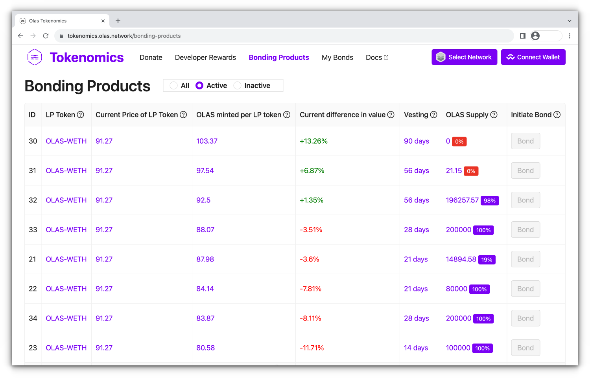
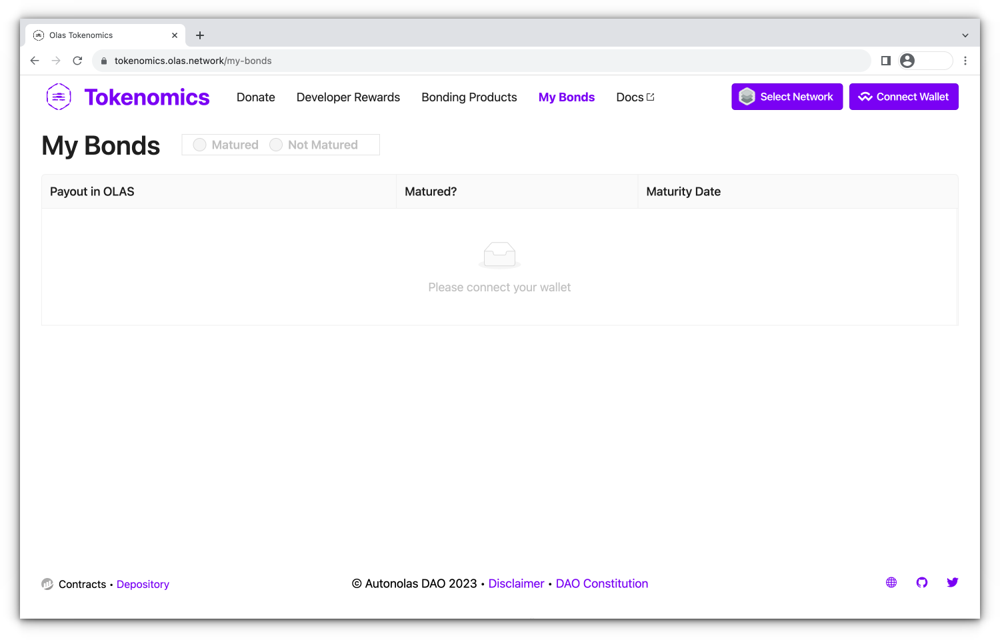

The Autonolas Protocol tokenomics is the economic model designed to foster the development and composability of autonomous services. The primary goal is to create a sustainable ecosystem to incentivize developers to contribute to the network and reward them for their participation proportionally to their efforts, while the platform itself grows and becomes more valuable.

Autonolas uses a **bonding mechanism** to grow the protocol-owned liquidity, a **staking model** for code to enable developers to track their code contributions on-chain, and **a system to distribute rewards** for useful code. Additionally, Autonolas aims to create a flywheel to **attract donations** and provide decentralized protocol-owned services to ensure ecosystem longevity.

!!! abstract "Learn more"

    Read the **Tokenomics** section in the {{ autonolas_whitepaper }} for the full details.

## The OLAS token

The protocol coordinates the goals described above through a tradable utility token,
[OLAS](https://etherscan.io/address/0x0001A500A6B18995B03f44bb040A5fFc28E45CB0), that will provide access to the core functionalities. The
token follows the ERC20 standard and is deployed on the Ethereum mainnet.

* OLAS can be locked for voting-escrow OLAS ([veOLAS](https://etherscan.io/address/0x7e01A500805f8A52Fad229b3015AD130A332B7b3)) to participate in the Autonolas DAO governance, thus shaping the protocol and its tokenomics.
* OLAS can be locked for veOLAS tokens for permissionless access to a service whitelist that
unlocks code owners’ top-ups (incentives in OLAS that boost the developers' ETH rewards). See the details [here](https://github.com/valory-xyz/autonolas-tokenomics/blob/main/docs/Autonolas_tokenomics_audit.pdf).
* OLAS can be used to acquire (on a third-party DEX) LP-tokens that are required for
bonding. This will enable protocol-owned liquidity and therefore support the protocol’s long-term growth.

## Incentivizing software developers

Let us briefly present how the staking model for agents and component code incentivizes software developers:

1. Developers stake agents and/or components on-chain by [minting their software packages as NFTs](./mint_packages_nfts.md#mint-a-component).
2. Service owners use staked agents and components to create autonomous
services. Then they [mint their service](./mint_packages_nfts.md#mint-a-service) in the Autonolas Protocol.
3. Services can receive ETH donations through the Autonolas Protocol as a sign of recognition for their effort and utility.
4. With a share of accrued donations, the protocol will reward the staked agents and/or components that facilitated such donations. Rewards are distributed proportionally to the code contribution to the donated services. Subject to governance approval, a portion of service donations can be eventually accrued by the Protocol Treasury and used by the DAO for ecosystem growth.
5. Moreover, when service owners or service donors meet a specific threshold of veOLAS (i.e., they have locked a certain amount of OLAS for a certain period of time), they are considered whitelisted. Under this condition, the protocol tops up the ETH rewards from donations by allocating a portion of the OLAS inflation to the staked components or agents associated with the whitelisted services.

## Incentivizing bonders

The Autonolas Tokenomics bonding mechanism enables users holding supported LP-pair assets, such as [Uniswap V2: OLAS-ETH](https://etherscan.io/address/0x09d1d767edf8fa23a64c51fa559e0688e526812f), to deposit them into the Autonolas depository smart contract. In return, they receive OLAS tokens at a discount relative to the price quoted on the relevant DEX after a vesting time. The interest rate on purchased bonds and the discount factor can be adjusted to incentivize or discourage bond demand. The protocol currently incentivizes bonding when there is a large potential output of code production in the ecosystem and a production function is used to measure potential code production during one epoch to establish the interest rate and discount factor.

This version maintains the key information while providing a clearer and more concise description of the process.

## Interacting with the protocol tokenomics

The {{ autonolas_protocol_tokenomics_dapp }} provides a front-end for **donors**, **bonders** and **developers** to interact with the tokenomics model of the protocol.

### Donate page

Anyone can make a voluntary donation to a given service. Donations to the protocol are distributed to agent or component owners according to their direct contribution measure. Developers can later claim their incentive proportionally to the usefulness of their code.

<figure markdown>
{ align=left width=500 }
</figure>

This page also displays the current epoch, the minimum epoch length, the estimated time for the current epoch to end and the end time of the previous one. 

Connect your wallet and indicate the service ID you wish to donate. Allowed actions:

* **Donate.** Donate the specified amount of ETH to the specified service. You can specify more than one service in a single call. The connected wallet will ask you to approve the transaction.

    !!! warning "Important"
        To avoid fragmented donations, the protocol currently only accepts donations of at least 0.065 ETH. (If the donation is for several services, the total sum must be at least 0.065 ETH.)

### Developer Rewards

Developers can use this screen to review and claim the incentives of the agents and components they own. 

<figure markdown>
{ align=left width=500 }
</figure>

 Connect your wallet and indicate the ID and unit type (agent or component) that you wish to refer to. Allowed actions:

* **Check for available rewards.** Review the incentives that a specified address can currently claim for the specified agents or components. You can specify more than one agent or component in a single call. Note that the specified address must be the owner of that components or agents to properly use this functionality.

* **Claim rewards.** Collects available rewards for the specified components or agents. You can specify more than one agent or component in a single call. The connected wallet will ask to approve the transaction. Note that rewards claiming is currently paused and will resume once governance reactivates withdrawals.

* **Estimate rewards for next epoch.** Estimate claimable rewards for the next epoch for the specified agent or component. Note that such rewards are estimated, as they might eventually change during the epoch due to other donations.

* **Checkpoint call.** When the time of the current epoch is passed, a checkpoint button is shown.  Anyone can call the checkpoint. The checkpoint allows a new epoch to start and projected incentives to be claimed. The connected wallet will ask to approve the transaction.

### Bonding programs page

Review bonding programs information and apply for a bond on an active program.

<figure markdown>
{ align=left width=500 }
</figure>

Connect your wallet and create a bond for the program you wish to apply. Allowed actions:

* **Bond.** Create a bond in any of the active bonding programs indicating the amount of LP tokens that you wish to bond. The connected wallet will ask to approve the transaction. Upon approval of the transaction you will need to specify a spending cap for the corresponding LP token pair.  

### My bonds page

Review OLAS payout for your bonds and redeem your matured ones.

<figure markdown>
{ align=left width=500 }
</figure>

Connect your wallet and redeem any of your matured bonds. Allowed actions:

* **Redeem.** Redeem your bond. The connected wallet will ask to approve the transaction.
